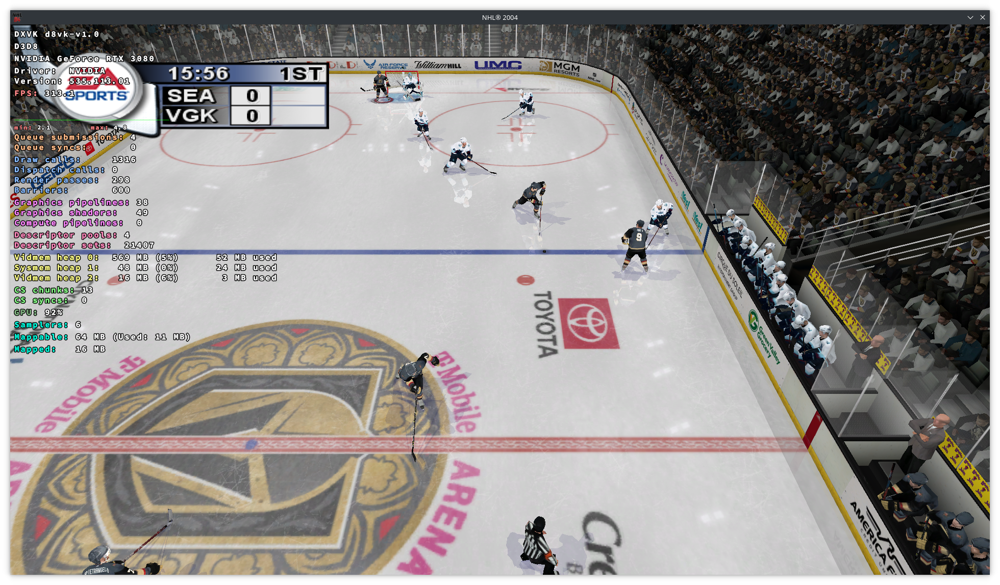

# NHL 04 on Linux Installer

This installer will guide users through setting up NHL 04 for PC on Linux. Download the AppImage [here](https://github.com/amanojeremie/nhl04-linux-installer/releases/tag/v0.1.0).

## Purpose

Attempting to run NHL 2004 on a standard Wine environment can result in multiple issues as detailed [here.](https://appdb.winehq.org/objectManager.php?sClass=application&iId=2943)
The installer aims to simplify the setup process by automatically running winetricks and patching game files that cause issues with Wine.

Includes a roster installer to streamline installing the latest rosters provided by the [NHL 04 Rebuilt project.](https://www.tapatalk.com/groups/nhl04rebuilt/nhl04-rebuilt-2023-2024-links-installation-info-t13.html)

## Requirements

- **NHL 2004 for PC: Discs 1 and 2 as .iso files.** Please note: this installer does **NOT** include or provide these game files.
  - Additionally, ensure you have the 16-digit code associated with your copy.
- **[Wine dependencies](https://www.gloriouseggroll.tv/how-to-get-out-of-wine-dependency-hell/)**. Note: Steam Deck users will already have these
- **[Vulkan support and Vulkan drivers](https://github.com/lutris/docs/blob/master/InstallingDrivers.md)**. Note: Steam Deck users will already have these

## Images
### EndeavourOS


*NHL 2004 running on EndeavourOS, with an NVIDIA RTX 3080 and proprietary drivers. Used the installer to setup NHL 2004 and install rosters. Running with DXVK_HUD=full.*

### Steam Deck


*NHL 2004 running on SteamOS, with a Steam Deck. Used the installer to setup NHL 2004 and install rosters. Running with Gamescope and DXVK_HUD=1*

## Building

To build the NHL 04 on Linux Installer application, first follow Tauri's [Prerequisites](https://tauri.app/v1/guides/getting-started/prerequisites) guide.

Install node dependencies then run Tauri's build script.

```
npm install
npm run tauri build
```

A Dockerfile is provided to build a redistributable for Linux environments. It's based off of Ubuntu 20.04 to provide a low GLIBC version requirement.
A workaround for [this](https://github.com/tauri-apps/tauri/issues/1355) Tauri issue.